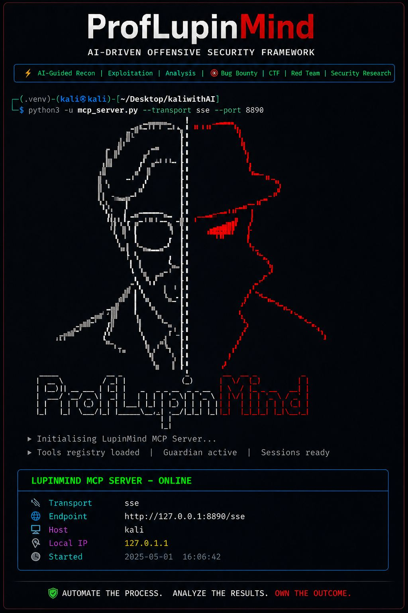

# ProfLupinMind



ProfLupinMind is a local cybersecurity assistant for authorized security testing on Kali/Linux. It connects an AI or MCP client to common security tools, runs approved tools and workflows against an allowed target, stores the results in local sessions, extracts useful findings, and generates reports.

The project is built for:

- Authorized penetration testing
- Internal security assessments
- Lab environments
- CTF practice
- Defensive reconnaissance and vulnerability review

ProfLupinMind is not a hosted SaaS product. It is designed to run locally on the tester's machine so that tools, logs, sessions, and reports stay under the user's control.

> Only use this project on systems you own or have explicit written permission to test.

## Quick Start

Recommended use: run ProfLupinMind through Claude Code in VS Code. Claude Code gives you the MCP chat/control surface, while `proflupinmind_console.py` gives you the live terminal-style output view.

For the easiest local setup:

```bash
cd /home/kali/Desktop/ProfLupinMind
./install.sh
```

To make ProfLupinMind available to Claude Code from any folder, install it and register the MCP server at Claude Code user scope:

```bash
cd /home/kali/Desktop/ProfLupinMind
./install.sh --claude-code
```

Then open VS Code, start Claude Code from any directory, and run:

```text
/mcp
```

You should see `proflupinmind` connected. Useful checks:

```bash
claude mcp list
claude mcp get proflupinmind
```

The installer creates a launcher at `~/.local/bin/proflupinmind-mcp`. The launcher uses absolute paths internally, so the MCP server starts from the ProfLupinMind project directory even when Claude Code is opened somewhere else.

For live output, open a second VS Code terminal and run:

```bash
cd /home/kali/Desktop/ProfLupinMind
source .venv/bin/activate
python3 proflupinmind_console.py
```

## What the Project Does

ProfLupinMind works like a controlled security testing workspace.

1. A user provides an authorized target, such as a domain, IP address, URL, API, container image, cloud asset, or local file.
2. The MCP server receives requests from an MCP client such as Claude Code.
3. The Guardian safety layer checks scope and risk before commands run.
4. ProfLupinMind runs selected local tools or predefined workflows.
5. Output is saved into a local session database.
6. The project parses results into findings, services, URLs, ports, CVEs, credentials, and other useful evidence.
7. The user can review the session and generate Markdown or HTML reports.

The project can run individual tools, such as `nmap`, `httpx`, `gobuster`, `ffuf`, `nuclei`, `sqlmap`, `trivy`, and other Kali/Linux security utilities. It can also run larger workflows for web testing, network reconnaissance, API testing, cloud assessment, container assessment, Kubernetes review, OSINT, vulnerability assessment, and CTF-style testing.

## How It Works

```text
User or MCP client
        |
        v
ProfLupinMind MCP server
        |
        v
Safety and scope checks
        |
        v
Local security tools and workflows
        |
        v
Session storage, parsed findings, logs, and reports
```

The main runtime file is `mcp_server.py`. It exposes tools to an MCP client, manages sessions, starts scans, checks safety rules, launches background tasks, and creates reports.

The optional Flask API in `proflupinmind_api.py` provides local HTTP access to selected tool endpoints. Most users should start with the MCP setup first.

## Deployment Plan

This deployment plan describes how someone can install ProfLupinMind locally, connect it to an MCP client, run an authorized assessment, and collect the results.

### 1. Prepare the Machine

Use a Linux system, preferably Kali Linux, because many security tools are already available or easy to install there.

Required:

- Python 3.10 or newer
- `python3-venv`
- `pip`
- Git or a local copy of this repository
- The security tools needed for your assessment

Example Kali package setup:

```bash
sudo apt update
sudo apt install -y python3 python3-venv python3-pip nmap gobuster ffuf sqlmap
```

Install any additional tools your workflow needs, such as `nuclei`, `subfinder`, `httpx`, `trivy`, `amass`, or cloud/container scanners.

Python dependencies install the ProfLupinMind application code. They do not install every external scanner automatically.

### 2. Install the Project

Use the installer for the smooth path:

```bash
cd /home/kali/Desktop/ProfLupinMind
./install.sh
```

Manual setup is also supported:

```bash
cd /home/kali/Desktop/ProfLupinMind
python3 -m venv .venv
source .venv/bin/activate
pip install -r requirements.txt
```

### 3. Configure Optional AI Features

AI-assisted analysis is optional. If you want to use those features, create a local `.env` file:

```bash
cp .env.example .env
```

Edit `.env` and add your key:

```text
ANTHROPIC_API_KEY=your_anthropic_api_key_here
```


### 4. Connect ProfLupinMind to Claude Code or Another MCP Client

The recommended interface is Claude Code inside VS Code. Use Claude Code to ask for scans, workflows, findings, and reports, and use `proflupinmind_console.py` in a second VS Code terminal to watch live output.

Recommended: register ProfLupinMind as a user-scoped Claude Code MCP server so it works from any folder:

```bash
cd /home/kali/Desktop/ProfLupinMind
./install.sh --claude-code
```

That runs the equivalent of:

```bash
claude mcp add -s user proflupinmind -- ~/.local/bin/proflupinmind-mcp --transport stdio
```

The repository also includes a project-local `.mcp.json` file for Claude Code if you prefer project-scoped setup:

```json
{
  "mcpServers": {
    "proflupinmind": {
      "type": "stdio",
      "command": "/home/kali/Desktop/ProfLupinMind/.venv/bin/python",
      "args": [
        "/home/kali/Desktop/ProfLupinMind/mcp_server.py",
        "--transport",
        "stdio"
      ]
    }
  }
}
```

Deployment steps:

1. Run `./install.sh --claude-code` once for user-scoped setup, or open `/home/kali/Desktop/ProfLupinMind` in VS Code for project-scoped setup.
2. Make sure dependencies are installed in `.venv`.
3. Start Claude Code in VS Code.
4. Approve the MCP server if Claude Code asks for confirmation.
5. In Claude Code, run:

```text
/mcp
```

You should see `proflupinmind` listed as a connected MCP server.

You can also check from the terminal:

```bash
claude mcp list
claude mcp get proflupinmind
```

If the project is moved to another folder, rerun `./install.sh --claude-code` or update the absolute paths inside `.mcp.json`.

### 5. Run a Local Smoke Test

Claude Code normally starts the MCP server automatically. To verify that the server can start manually:

```bash
source .venv/bin/activate
timeout 3 python3 mcp_server.py --transport stdio
```

When stdio mode is run outside an MCP client, it may exit because no MCP client is connected. That is acceptable as long as there is no Python traceback.

For an SSE deployment instead of stdio:

```bash
source .venv/bin/activate
python3 mcp_server.py --transport sse --host 127.0.0.1 --port 8890
```

Use SSE only on trusted local interfaces unless you have added your own network protections.

### 6. Define the Authorized Target and Scope

Before running tools, decide exactly what is allowed.

Examples of valid scopes:

- A local lab IP such as `192.168.56.10`
- A domain you own
- A staging URL your team authorized
- A container image you are responsible for
- A CTF machine in a lab environment

Use read-only mode when learning or performing discovery. Read-only mode helps prevent active exploitation, credential attacks, destructive operations, and other higher-risk behavior.

Example MCP request:

```text
Run a read-only network reconnaissance workflow against 192.168.56.10. The authorized scope is 192.168.56.10 only.
```

### 7. Run Tools or Workflows

ProfLupinMind can run a single tool or a full workflow.

Common MCP tools include:

- `run_kali_tool`
- `run_workflow`
- `start_tool_task`
- `start_workflow_task`
- `list_tasks`
- `get_task_result`
- `get_session_findings`
- `generate_report`
- `server_health`
- `tool_doctor`

Example single-tool request:

```text
Run nmap against 192.168.56.10 in read-only mode and save the results to a session.
```

Example workflow request:

```text
Run the Web Application Pentest workflow against https://staging.example.com in read-only mode.
```

Example background task request:

```text
Start a nuclei scan against https://staging.example.com as a background task, then show me the task ID.
```

After starting a background task, ask:

```text
List active tasks and show the result for the completed scan.
```

### 8. Watch Live Output

When Claude Code starts the MCP server in the background, scanner output may not appear in the Claude Code chat. Use the console viewer for the best live output experience:

```bash
cd /home/kali/Desktop/ProfLupinMind
source .venv/bin/activate
python3 proflupinmind_console.py
```

ProfLupinMind also writes live output to local logs:

```text
proflupinmind.raw.log
proflupinmind.events.jsonl
```

Or follow the raw log:

```bash
tail -f proflupinmind.raw.log
```

### 9. Review Findings

Each assessment is saved into a local session. A session may include:

- Target and scope
- Commands that were executed
- Tool output excerpts
- Parsed findings
- Open ports
- Services
- URLs
- CVEs
- Credentials or secrets discovered by tools
- Other evidence collected during the run

From an MCP client, ask:

```text
Show the findings from the latest session.
```

Or:

```text
Summarize the open ports, services, URLs, and vulnerabilities from this session.
```

Session data is stored locally in:

```text
sessions/proflupinmind.sqlite3
```

### 10. Generate a Report

After scans are complete, generate a report from the saved session:

```text
Generate a Markdown and HTML report for the latest session.
```

Reports are written under:

```text
reports/output/
```

Markdown and HTML reports are supported by default. PDF export may require WeasyPrint and additional system libraries.

### 11. Optional Local Flask API Deployment

The Flask API is useful when you want local HTTP access instead of MCP.

Start the API:

```bash
source .venv/bin/activate
python3 proflupinmind_api.py
```

Check that it is running:

```bash
curl http://127.0.0.1:8887/health
```

By default, the raw command endpoint is disabled. This is safer. Named tool endpoints, such as `/api/tools/nmap`, are available.

To require an API key for POST requests:

```bash
export PROFLUPINMIND_REQUIRE_API_KEY=1
export PROFLUPINMIND_API_KEY="change-me"
python3 proflupinmind_api.py
```

Send the key with requests:

```text
X-API-Key: change-me
```

Keep the Flask API bound to `127.0.0.1` unless you have a clear reason and proper access controls.

## Example User Flow

This is a practical first run for a lab target:

1. Install dependencies and, optionally, register Claude Code globally:

```bash
cd /home/kali/Desktop/ProfLupinMind
./install.sh --claude-code
```

2. Start Claude Code in VS Code from any folder.

3. Confirm the MCP server is connected:

```text
/mcp
```

4. Ask ProfLupinMind to check its runtime:

```text
Run server_health and tool_doctor.
```

5. Run a read-only scan against an authorized lab host:

```text
Run the Network Reconnaissance workflow against 192.168.56.10 in read-only mode. The authorized scope is only 192.168.56.10.
```

6. Watch live output in a second VS Code terminal:

```bash
cd /home/kali/Desktop/ProfLupinMind
source .venv/bin/activate
python3 proflupinmind_console.py
```

7. Review results:

```text
Show the findings from the latest session and summarize the most important risks.
```

8. Generate a report:

```text
Generate a Markdown and HTML report for the latest session.
```

## Safety Model

ProfLupinMind includes safety controls, but the user is still responsible for authorization and legal use.

- Scope checks help prevent testing outside the approved target.
- Read-only mode blocks many active or destructive actions.
- Dangerous operations require explicit permission.
- The raw API command endpoint is disabled by default.
- API inputs are checked to reduce command injection risk.

Use read-only mode for discovery, learning, and early assessment phases. Enable higher-risk actions only when the target owner has clearly authorized them.

## Troubleshooting

### The MCP server does not appear

Run:

```bash
claude mcp list
claude mcp get proflupinmind
```

Check that `.mcp.json` points to the correct Python path and project path.

### A Python module is missing

Run:

```bash
source .venv/bin/activate
pip install -r requirements.txt
```

### A scanner is missing

Install the external tool. For example:

```bash
sudo apt install -y nmap gobuster ffuf sqlmap
```

Some tools, such as `nuclei`, `subfinder`, `httpx`, or `trivy`, may require separate installation instructions from their maintainers.

### A command is blocked

The command may be outside the authorized scope or blocked by read-only mode. Confirm the scope, use safer options, or explicitly authorize higher-risk behavior only when appropriate.

## Responsible Use

ProfLupinMind is for authorized security testing, defensive assessment, internal review, CTFs, and lab work. Do not use it against third-party systems without permission.
